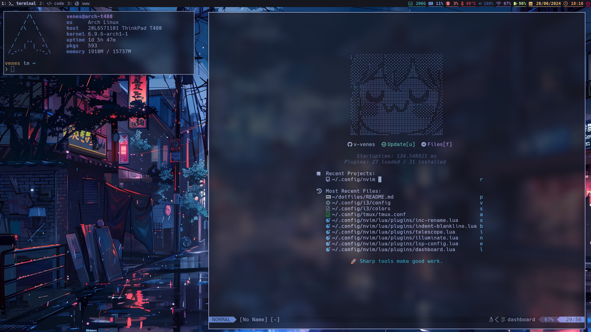

<h1 align="center">venes's dotfiles</h1>

<div align="center">
My attempt to create a rice for Arch Linux, Feel free to use any configuration you find usefull. 😃

⚠️  I still have a lot of things to configure so this project isn't finished yet.
</div>

---



> I'm trying to use [tokyonight-theme]("https://github.com/folke/tokyonight.nvim") (night version) colors.  
---

## Information

- **OS**: [Arch Linux]("https://archlinux.org/")
- **WM**: [i3]("https://i3wm.org/") and [i3blocks]("https://github.com/vivien/i3blocks")
- **DM**: [lightdm (gtk-greeter)]("https://github.com/canonical/lightdm") 
- **Compositor**: [picom]("https://github.com/yshui/picom")
- **Application launcher**: [rofi]("https://github.com/davatorium/rofi")
- **Font**: [Hack Nerd Font]("https://github.com/ryanoasis/nerd-fonts/releases/download/v3.2.1/Hack.zip")
- **Terminal**: [kitty]("https://github.com/kovidgoyal/kitty"), [zsh]("https://www.zsh.org/"), [spaceship]("https://spaceship-prompt.sh/"), and [tmux]("https://github.com/tmux/tmux")
- **Editor**: [nvim]("https://neovim.io/")
- **File manager**: [ranger]("https://github.com/ranger/ranger") and [Thunar]("https://docs.xfce.org/xfce/thunar/start")
- **Theme**: [Arc-Dark]("https://github.com/horst3180/arc-theme")
- **Icons**: [Papyrus-Dark]("https://github.com/PapirusDevelopmentTeam/papirus-icon-theme")
- **Cursor**: [ComixCursors]("https://limitland.de/comixcursors")


## Installation
I'm using [stow]("https://www.gnu.org/software/stow/") for managing my dotfiles, all the packages are in `packages` folder, so you can use:
```sh
stow -v -R -d ./packages/ -t ~/ -S ./
```
> -t is the target folder / -d is the stow directory / -S id for package names

Or if you want to use just some packages:
```sh
stow -v -R -d ./packages/ -t ~/ -S nvim tmux
```

## Todos

* [ ] List all the dependencies
* [ ] Improve this readme
* [ ] Bash script to auto install
* [ ] Test with other computers
* [ ] Test some configs(zsh, kitty, tmux and nvim) with MacOS

